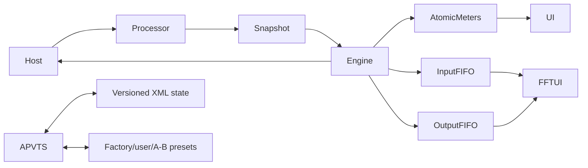

# Architecture

The `AudioProcessor` owns one `AudioProcessorValueTreeState`, preset manager, and `BroadcastProcessorEngine`. Construction creates stable parameters and the conservative Safe Start preset. `prepareToPlay` allocates every audio buffer/delay/FIFO and reports the combined oversampler plus fixed maximum limiter delay. `processBlock` takes one atomic parameter snapshot and performs no file access, XML, preset work, GUI calls, locks, or intentional heap allocation.

The engine modules are input, AGC, EQ, crossover, multiband dynamics, enhancer, stereo management, oversampled clipper, limiter, and metering. The crossover owns four preallocated band buffers. Analyzer FIFOs use `AbstractFifo`; FFT/windowing runs on the 30 Hz message-thread timer. Meter values use atomics.

State schema version 1 stores all APVTS values, A/B trees, selected snapshot, factory reference, analyzer preferences, and editor dimensions. Unknown properties are tolerated; invalid binary/XML or a wrong root type is rejected without replacing current state. `PresetManager` performs filesystem work only from UI/host control paths.

The editor uses parameter attachments for every displayed control, a draggable EQ/FFT surface, a scrollable advanced control field, actual meter atomics, and responsive bounds. JUCE's standalone wrapper supplies audio-device and channel selection while reusing the identical processor and editor.

